<div align="center">


# Pigeon

**A fast, native API client for Linux.**
Build, send and test HTTP requests in an app that starts instantly and feels at home on GNOME.


[](LICENSE)

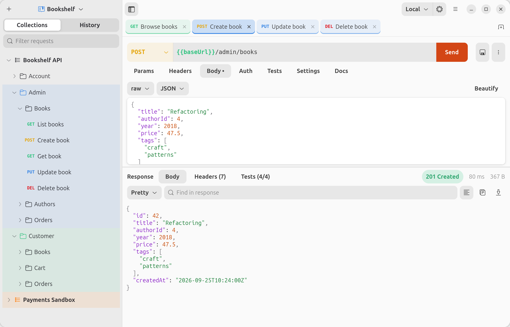

</div>

## Why Pigeon?

- **Native.** Written in Rust with GTK4 and libadwaita: a single ~10 MB binary, no browser engine, no Electron.
- **Local-first.** No account, no sign-in, no cloud sync. Your projects are plain JSON files on your disk.
- **Built for real APIs.** Import an OpenAPI/Swagger spec, organize requests into projects and folders, switch environments, and test responses. It's all in one window.

---

## Features

### Requests and responses

Every HTTP method, with query params kept in sync with the URL both ways.

- **Headers**, with a bulk-edit mode.
- **Bodies**: raw JSON / XML / HTML / Text / JavaScript (with syntax highlighting and *Beautify*), `x-www-form-urlencoded`, multipart `form-data` with file uploads, binary files, and GraphQL (query + variables).
- **Responses**: status, time and size at a glance; pretty or raw body; image preview; find in response; headers; cookies; copy or save to a file.
- Per-request settings for redirects, TLS verification and timeouts. HTTP/2, gzip/brotli/zstd and a shared cookie jar are built in.

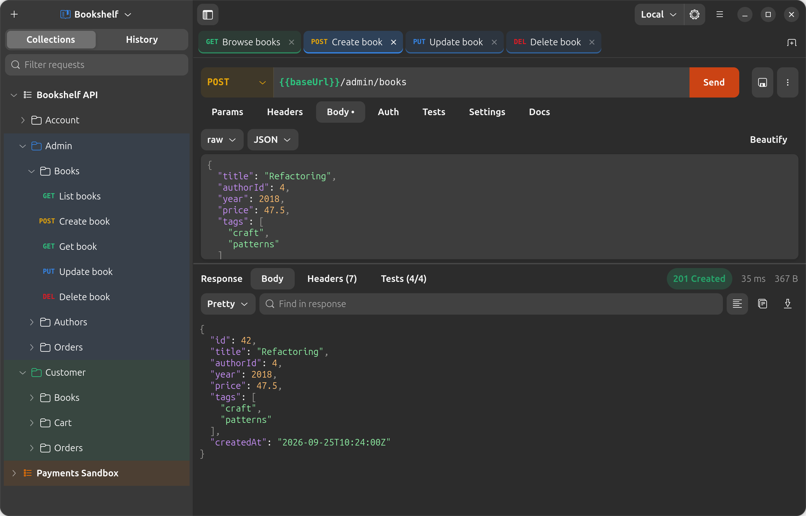

<sub>Light and dark mode follow your system.</sub>

### Tests

Add assertions to any request and see them pass or fail with every response. You can assert on `status`, `time` (ms), `body`, `header.Name` or any JSON path like `json.data[0].id`.

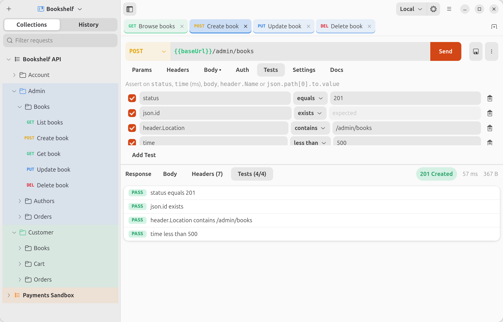

### Variables, path variables and environments

- **`{{variables}}`** work everywhere: URL, headers, body and auth. Defined variables show **green** in the URL bar and undefined ones **red**. Hover the URL to see it fully resolved.
- **Scopes**: environment › collection › globals. Built-ins include `{{$guid}}`, `{{$timestamp}}`, `{{$isoTimestamp}}` and `{{$randomInt}}`.
- **Path variables**: segments like `/books/:id` get their own table under *Params*.

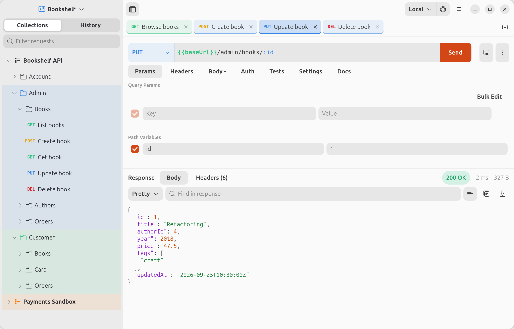

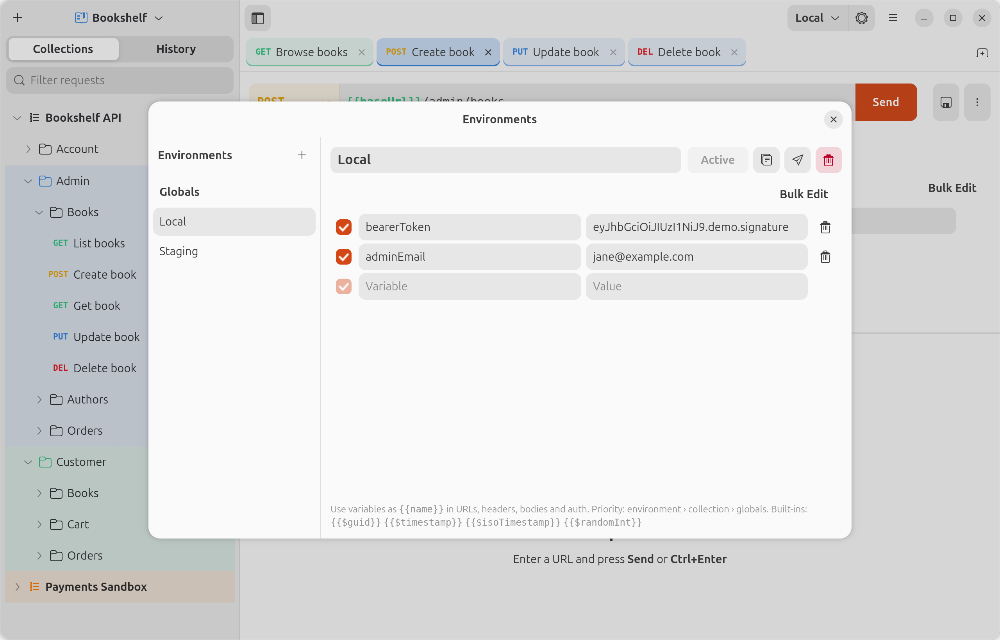

### Authentication

Bearer token, Basic auth or API key (header or query), set per request or **inherited** down the chain: *project → collection → folder → request*. The Auth tab always tells you where inherited credentials come from. Set up auth once for a whole project and use a `{{token}}` variable so each environment brings its own.

### OpenAPI / Swagger import

Point Pigeon at a spec (OpenAPI 3.x or Swagger 2.0, JSON or YAML) from a **file or a URL**. A docs page URL like `http://localhost:3000/docs` is enough; Pigeon finds the spec behind it.

- Tags become folders. APIs split by audience (`/admin/…`, `/customer/…`) get one folder per audience with a subfolder per resource.
- `{id}` becomes a `:id` path variable, and request bodies are generated from the schemas.
- Security schemes become auth (using `{{bearerToken}}`-style variables), and public endpoints get *No Auth*.
- **Sync with OpenAPI Spec** pulls in endpoints added to the API later. It only adds; it never overwrites your edits.

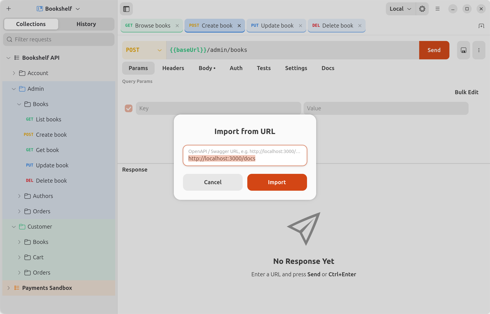

You can also paste a **cURL command** straight into the URL bar, or import and export collections (v2.x JSON) and environments.

### Organize your work

**Projects** keep separate workspaces apart. Each has its own collections, environments, history and open tabs, plus an icon: pick a built-in one with a color, or use your own image.

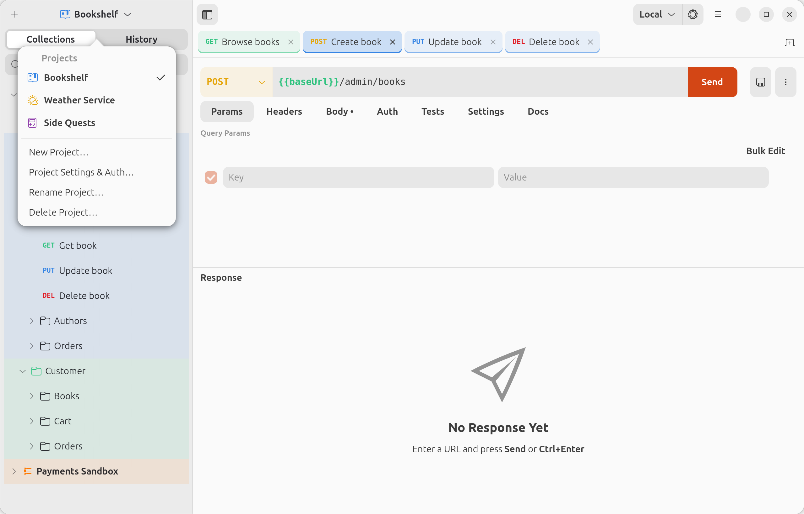

**Folder colors**, like in your IDE: color a collection or folder and everything inside gets a soft tint, including its open tabs. In *Preferences* you can choose whether colors reach subfolders, only the folder's own requests, or just the folder row.

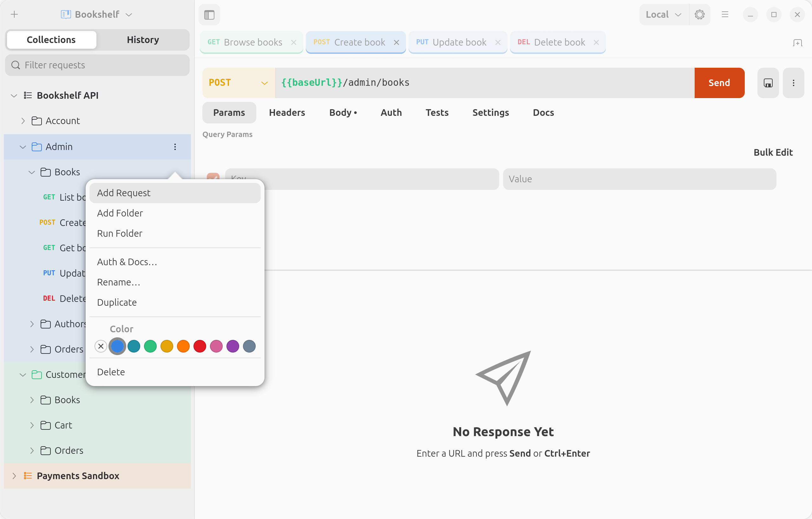

**Tabs** have color-coded methods and a right-click menu: save, rename, duplicate, *Reveal in Sidebar*, copy as cURL, and close others / to the right / all. Open tabs, including unsaved edits, are restored on the next launch.

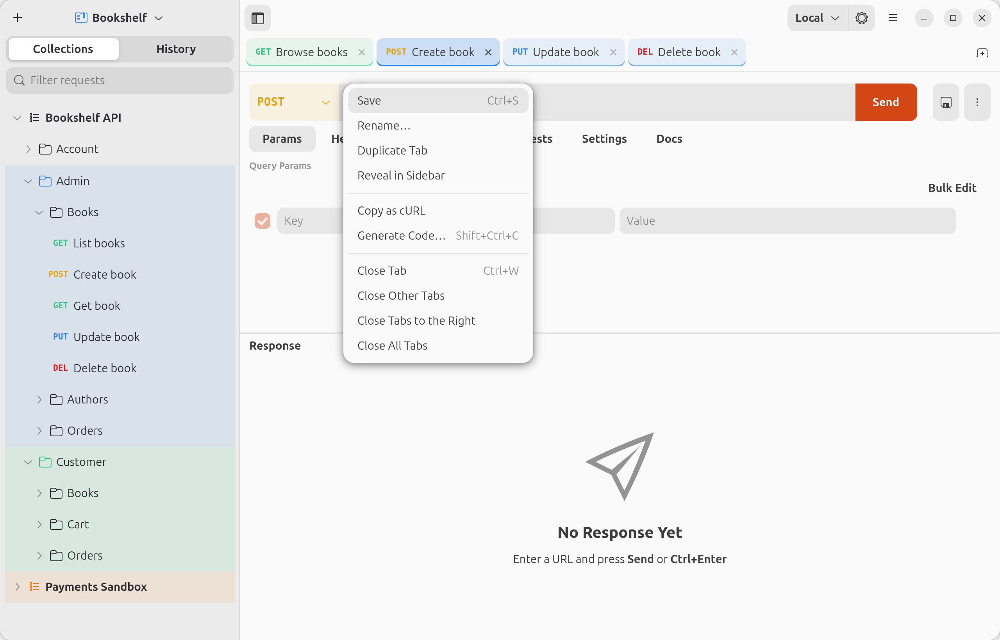

### Collection runner

Run a whole collection or folder, repeat it for several iterations, add a delay between requests, and optionally stop at the first failure. Every request's status, timing and test results are listed.

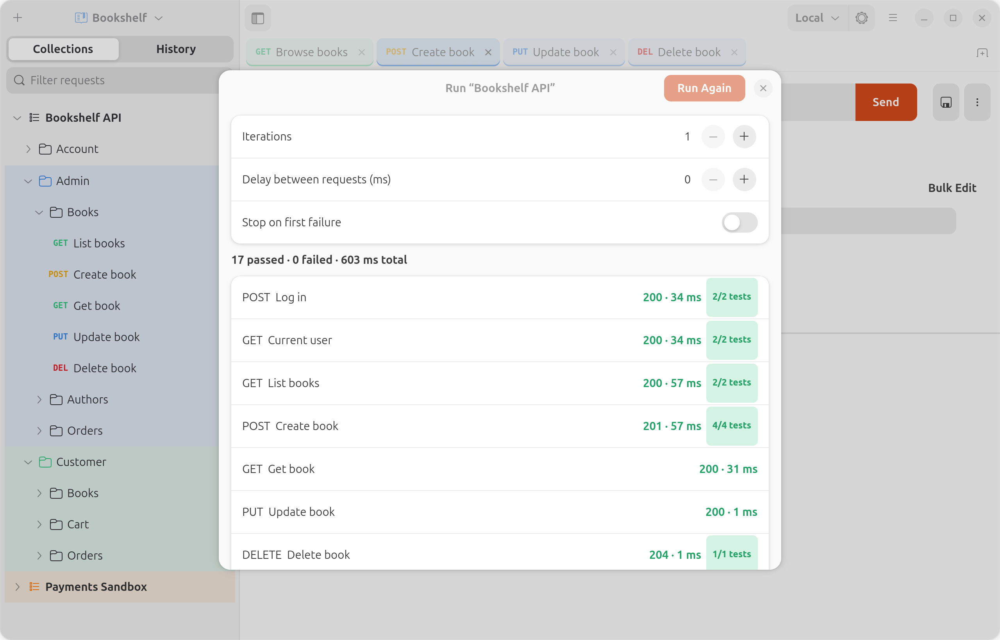

### Code generation

Turn any request into a ready-to-run snippet: **cURL**, raw **HTTP**, **Python** (requests), **JavaScript** (fetch), **Node.js** (axios), **Go** (net/http) and **Rust** (reqwest). Variables and inherited auth are resolved for you.

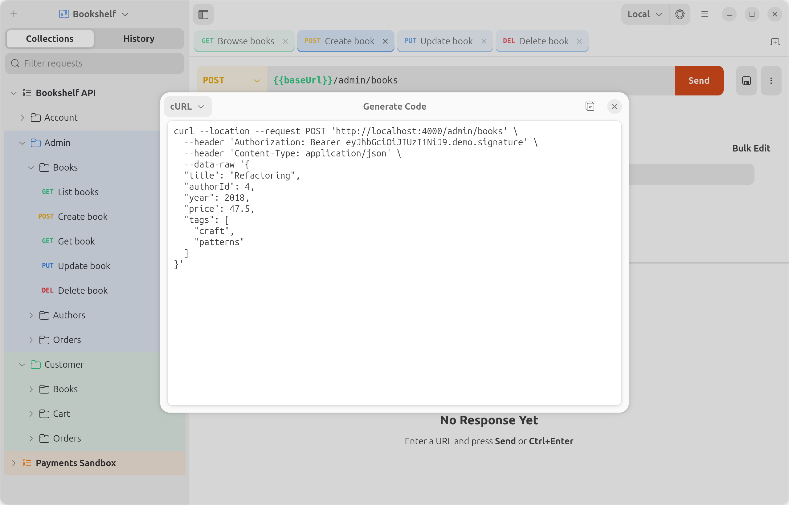

### Make it yours

Pick from five app icons (Dusk, Cobalt, Mint, Sunrise and Ivory). The choice applies to the dock and app grid too.

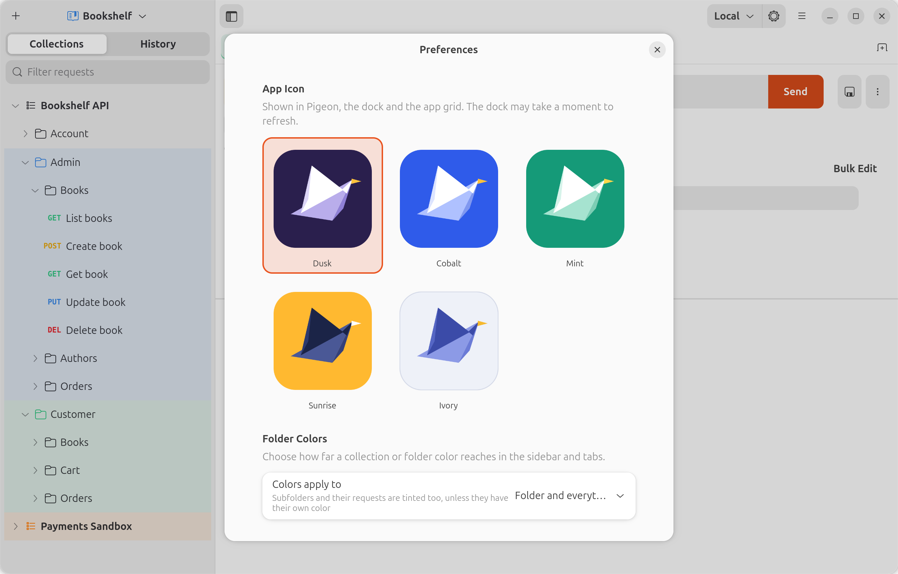

---

## Install

Pigeon needs **GTK ≥ 4.12** and **libadwaita ≥ 1.7** (e.g. Ubuntu 25.04+ or Fedora 42+). Building requires **Rust 1.85+**; get it from [rustup](https://rustup.rs) if your distribution's is older.

### Debian / Ubuntu

Download the `.deb` from the [releases page](https://github.com/optis20052/Pigeon/releases) and run `sudo apt install ./pigeon_*.deb`, or build it yourself:

```sh
sudo apt install libgtk-4-dev libadwaita-1-dev dpkg-dev   # build dependencies
./packaging/build-deb.sh                                # → target/deb/pigeon_<version>_<arch>.deb
sudo apt install ./target/deb/pigeon_*.deb
```

### Fedora

```sh
./packaging/build-rpm.sh            # builds inside a Fedora 43 container (needs Docker)
sudo dnf install ./target/rpm/pigeon-*.rpm
```

Or download the `.rpm` from the [releases page](https://github.com/optis20052/Pigeon/releases).

### Per-user install (any distribution)

```sh
./install.sh        # installs into ~/.local
```

### Run from source

```sh
cargo run --release
```

## Keyboard shortcuts

| Keys | Action |
|---|---|
| <kbd>Ctrl</kbd>+<kbd>Enter</kbd> | Send request |
| <kbd>Ctrl</kbd>+<kbd>S</kbd> | Save request |
| <kbd>Ctrl</kbd>+<kbd>T</kbd> | New tab |
| <kbd>Ctrl</kbd>+<kbd>W</kbd> | Close tab |
| <kbd>Ctrl</kbd>+<kbd>L</kbd> | Focus the URL bar |
| <kbd>Ctrl</kbd>+<kbd>O</kbd> | Import a file |
| <kbd>Ctrl</kbd>+<kbd>E</kbd> | Environments |
| <kbd>Ctrl</kbd>+<kbd>Shift</kbd>+<kbd>C</kbd> | Generate code |
| <kbd>Ctrl</kbd>+<kbd>,</kbd> | Preferences |
| <kbd>F9</kbd> | Toggle the sidebar |

## Your data

Everything lives in plain JSON under `~/.local/share/pigeon/`:

| Path | Contents |
|---|---|
| `projects.json` | Your projects |
| `projects/<id>.json` | A project's collections, environments, globals and history |
| `sessions/<id>.json` | A project's open tabs |
| `settings.json` | App preferences |

## Project layout

```
src/
├── main.rs            app startup, shortcuts
├── model.rs           projects, collections, requests, auth inheritance
├── http.rs            request preparation and execution (reqwest + tokio)
├── vars.rs            {{variables}} and :path variables
├── assertions.rs      response tests
├── openapi.rs         OpenAPI / Swagger import and sync
├── interchange.rs     collection/environment JSON, cURL parsing
├── codegen.rs         code snippets
├── storage.rs         files on disk
└── ui/                GTK4 / libadwaita interface
```

## License

Pigeon is released under the [MIT License](LICENSE).
